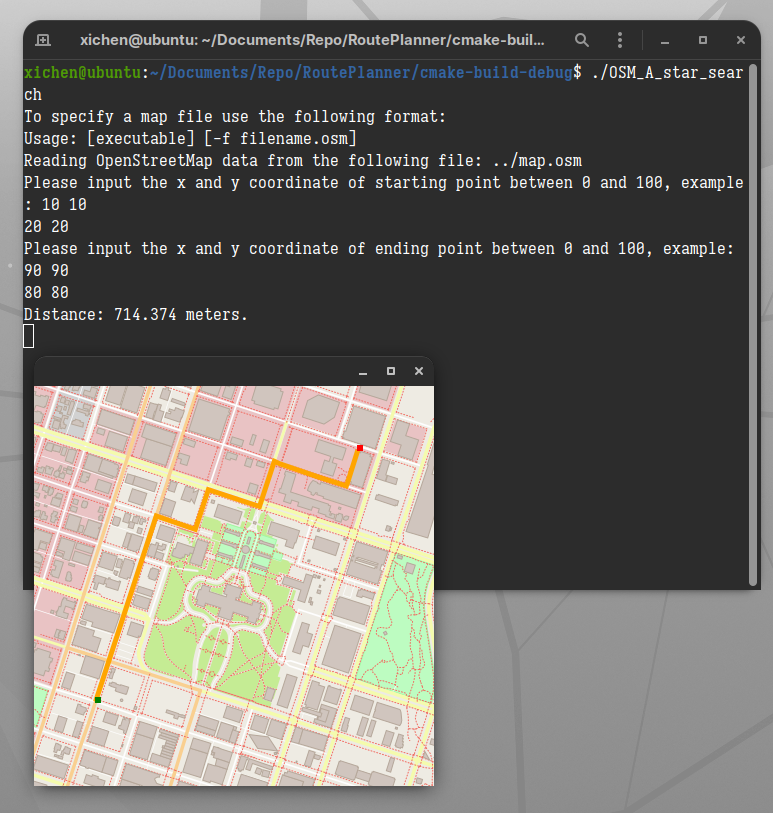

# Route Planner

## Description


This is a tool for route planning with OpenStreetMap. To use it, you need to provide an OpenStreetMap XML (*.osm) and specify the start and end point. The program then calculates the shortest path using Dijkstra's algorithm and visualizes the result.

An example will be: start point (0.2, 0.2), end point (0.8, 0.8)



## Usage
### Dependencies
* cmake >= 3.11.3
* make >= 4.1
* gcc/g++ >= 7.4.0
* [IO2D](https://github.com/cpp-io2d/P0267_RefImpl/blob/master/BUILDING.md)
* 
### Cloning

```
git clone https://github.com/xichen-de/RoutePlanner.git
```

### Compiling
To compile the project, first, create a `build` directory and change to that directory:
```
mkdir build && cd build
```
From within the `build` directory, then run `cmake` and `make` as follows:
```
cmake ..
make
```
### Running
The executable will be placed in the `build` directory. From within `build`, you can run the project as follows:
```
./OSM_A_star_search
```
Or to specify a map file:
```
./OSM_A_star_search -f ../<your_osm_file.osm>
```

### Testing

The testing executable is also placed in the `build` directory. From within `build`, you can run the unit tests as follows:
```
./test
```
